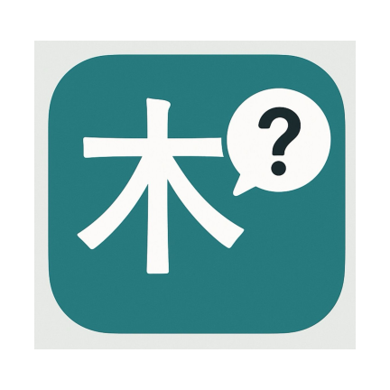
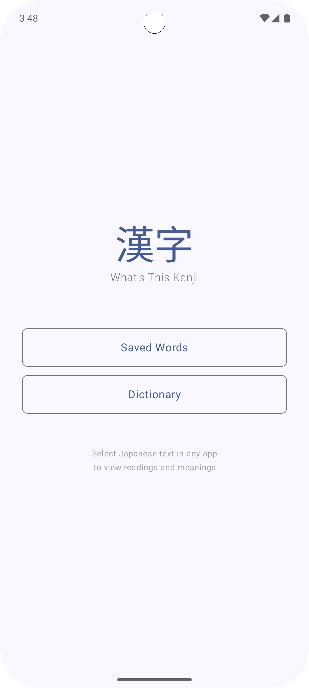
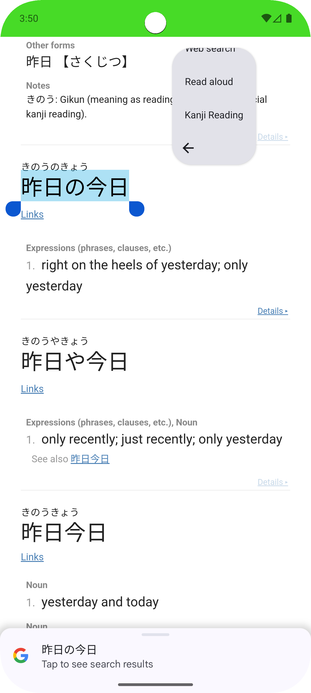
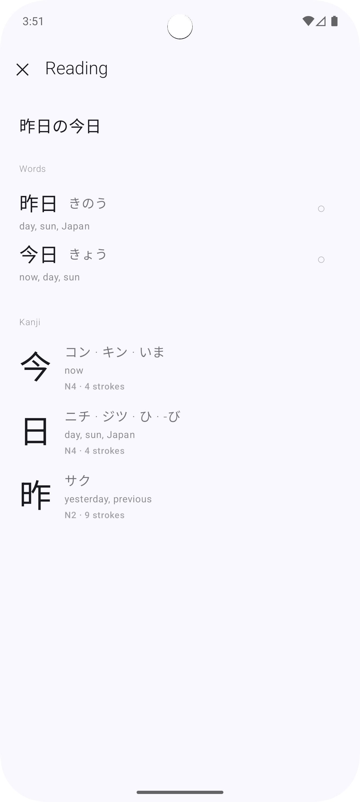
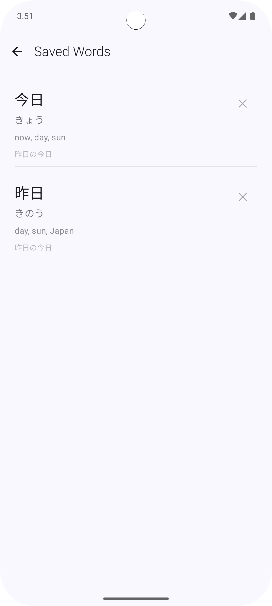
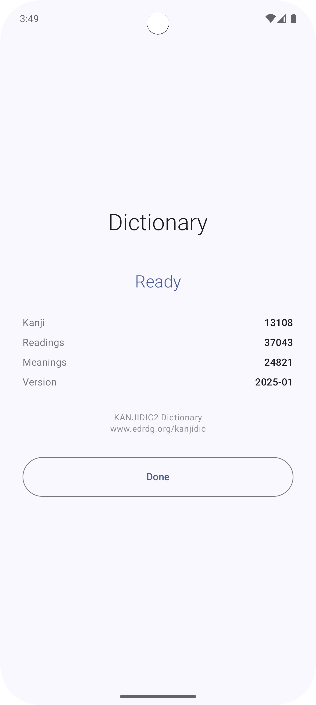

<div align="center">
  

# What's This Kanji

  [](https://developer.android.com)
  [](https://android-arsenal.com/api?level=31)
  [](https://kotlinlang.org)
  [](https://gradle.org)
  [](https://openjdk.org)
  [](LICENSE)

  Android app for Japanese text processing and kanji lookup with offline KANJIDIC2 dictionary.
</div>

## Screenshots

<div align="center">
  
  
  
</div>

## Features

- System-wide text selection support via PROCESS_TEXT intent
- Offline kanji dictionary with 13,000+ characters
- Japanese text tokenization and word segmentation
- Readings (on-yomi and kun-yomi) and English meanings
- Save words for review
- Material 3 design with light/dark theme support

## Technical Stack

- Kotlin with Jetpack Compose
- Room database for offline storage
- Kuromoji for Japanese tokenization
- KANJIDIC2 dictionary data
- Material 3 components

## Requirements

- Android 12 (API 31) or higher
- ~3MB storage for dictionary

## Usage

1. Select Japanese text in any app
2. Tap "Kanji Reading" in the text selection menu
3. View readings, meanings, and kanji details
4. Save words for later review

## Building

```bash
./gradlew assembleDebug
```

## Setting Up the Dictionary Database

The app requires a pre-generated SQLite database from the KANJIDIC2 XML file. Follow these steps to set it up:

### 1. Download KANJIDIC2

Download the latest KANJIDIC2 XML file from the EDRDG project:

```bash
# Download the compressed XML file
curl -O http://www.edrdg.org/kanjidic/kanjidic2.xml.gz

# Extract it
gunzip kanjidic2.xml.gz
```

### 2. Generate the Database

Use the provided Python script to convert the XML file to a SQLite database:

```bash
# Requires Python 3 (no additional dependencies needed)
python3 generate_database.py kanjidic2.xml
```

The script will:
- Create a `kanjidic2.db` file with the correct schema
- Parse ~13,000 kanji characters with their readings and meanings
- Generate a ~3MB database file
- Show progress and statistics during generation

### 3. Copy to Assets

After the database is generated, copy it to the app's assets folder:

```bash
cp kanjidic2.db app/src/main/assets/
```

### 4. Build the App

Now you can build the app with the dictionary included:

```bash
./gradlew assembleDebug
```

### Troubleshooting

- **Python not found**: Install Python 3.6 or higher
- **XML parsing errors**: Ensure you downloaded the complete XML file
- **Database size**: The final database should be around 3MB
- **App crashes on launch**: Verify the database file is in `app/src/main/assets/kanjidic2.db`

## Dictionary Data

This app uses the [KANJIDIC2](http://www.edrdg.org/wiki/index.php/KANJIDIC_Project) dictionary, developed by the Electronic Dictionary Research and Development Group (EDRDG).

## More Screenshots

<div align="center">
  
  
  
</div>

## License

MIT
